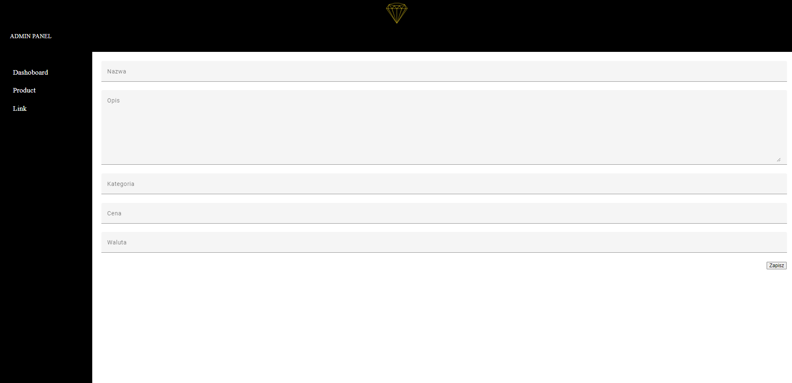

# Dokumentacja Aplikacji TavelloWeB
 
> Aplikacja TravelloWeb stworzona za pomocą technologi .NET wraz z wykorzystaniem języka C#. To narzędzie służy do rejestrowania, logowania, dodawania ogłoszeń wycieczek podróży, przeglądania ogłoszeń i rezerwacji biletów.
 
## Spis Treści
* [Informacje Ogólne](#informacje-ogólne)
* [Technologie Użyte](#technologie-użyte)
* [Funkcjonalności](#funkcjonalności)
* [Zrzuty Ekranu](#zrzuty-ekranu)
* [Status Projektu](#status-projektu)
* [Plan Rozwoju](#plan-rozwoju)
* [Twórcy](#twórcy)
* [Kontakt](#kontakt)
 
## Informacje Ogólne
- Celem aplikacji jest kupno produktów na stronie internetowej oraz obłusga sklepu za pomocą panelu admina.
 
## Technologie Użyte
- Java
- Spring
- MySQL
 
## Funkcjonalności
- Rejestracja, logowanie i wylogowywanie użytkowników.
- Dodawanie nowych produktów w sklepie.
- Edycja produktów.
- Kupno produktów.

 
## Zrzuty Ekranu

**Strona główna**

**Logowanie**

**Produkty**

**Strona Admina**

**Edycja Produktów**

 

 
## Jak Korzystać
- Zarejestruj się i zaloguj do aplikacji, aby korzystać z pełnej funkcjonalności.
- Dodawaj, edytuj i przeglądaj produktów.
- Edycja produktów w panelu admina.
 
## Status Projektu
Projekt jest w trakcie rozwoju.
 
## Plan Rozwoju
- Wprowadzenie pełnej funkcjonalnościu zakupu produktów.
- Możliwość logowania się.
 
## Twórca
- Projekt stworzony przez [@Roshuu](https://github.com/Roshuu).
 
## Kontakt
- W przypadku pytań lub sugestii, proszę kontaktować się z twórcami projektu.
